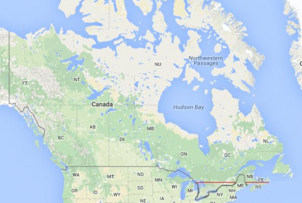

<!-- .slide: data-background-image="img/gis.jpg" data-background-size="contain"-->
<!-- .slide: class="hover"-->

### _The city is in the eye of the beholder. The World’s Eyes_ et la question des données publiques

#### Enrico Agostini-Marchese
Colloque : Art public, sites et cultures numériques
 
UdeM - 30 mai 2019

 <!-- .element: class="logo" style="width:30%; background-color:ghostwhite;padding: 5px" -->

<!-- .element: style="font-size:1.4rem" -->

 <!-- .element: class="logo" -->

§§§§§§§§§§§§§§§§§§§§§§§§§§§§§§§§§§§§§§§§§§§§§
<!-- .slide: data-background-image="img/chaire.png" data-background-size="contain"-->
%%%%%%%%%%%%%%%%%%%%%%%%%%%%%%%%%%%%%%%%%%%%%
<!-- .slide: data-background-image="img/market.jpg" -->
<!-- .slide: class="hover"-->

### Deux tendances du « faire-ville » : la centralisation

<small>
> « L’espace urbain rassemble les foules, les produits sur les marchés, les actes et les symboles. Il les concentre, il les accumule. Qui dit “spatialité urbaine”, dit aussi centre et centralité »

> « La centralité se veut totale. A ce titre elle prétend (implicitement ou non) définir une rationalité supérieure, politique — étatique, “urbaine”. […] Cette centralité expulse, avec une violence inhérente à l’espace lui-même, des éléments périphériques. La centralité, ou plutôt la centralisation, se veut et se fait “totalisante” »

</small>

Henri Lefebvre, _La production de l'espace_, Paris, Anthropos, 1974.

<!-- .element: class="source" -->
§§§§§§§§§§§§§§§§§§§§§§§§§§§§§§§§§§§§§§§§§§§§§
La moitié de la population canadienne habite en dessous de la ligne rouge

§§§§§§§§§§§§§§§§§§§§§§§§§§§§§§§§§§§§§§§§§§§§§
<!-- .slide: data-background-image="img/market.jpg" -->
<!-- .slide: class="hover"-->

### Deux tendances du « faire-ville » : la centralisation

<small>
> « L’espace urbain rassemble les foules, les produits sur les marchés, les actes et les symboles. Il les concentre, il les accumule. Qui dit “spatialité urbaine”, dit aussi centre et centralité »

> « La centralité se veut totale. A ce titre elle prétend (implicitement ou non) définir une rationalité supérieure, politique — étatique, “urbaine”. […] Cette centralité expulse, avec une violence inhérente à l’espace lui-même, des éléments périphériques. La centralité, ou plutôt la centralisation, se veut et se fait “totalisante” »

</small>

Henri Lefebvre, _La production de l'espace_, Paris, Anthropos, 1974.

<!-- .element: class="source" -->
§§§§§§§§§§§§§§§§§§§§§§§§§§§§§§§§§§§§§§§§§§§§§
<!-- .slide: data-background-image="img/derive.jpg" -->
<!-- .slide: class="hover"-->

### Deux tendances du « faire-ville » : la relationnalité
<small>
> « Although clarity or legibility is by no means the only important property of a beautiful city, it is of special importance when considering environments at the urban scale of size, time, and complexity. To understand this, we must consider not just the city as a thing in itself, but the city being perceived by its inhabitants »

> « A two-way process between the observer and his environment. The environment suggests distinctions and relations, and the observer [...] selects, organizes, and endows with meaning what he sees »
</small>

Kevin Lynch, _The Image of the City_, Cambridge, Mass.- London, MIT Press, 1960.

<!-- .element: class="source" -->
%%%%%%%%%%%%%%%%%%%%%%%%%%%%%%%%%%%%%%%%%%%%%
<!-- .slide: data-background-image="img/sidewalkToronto.png" -->
<!-- .slide: class="hover"-->
### La centralité aujourd'hui : _Sidewalk Toronto_, « a neighborhood built from the internet up »

- GAFAM et le monopole des données
- Narrative commerciale et marketing
- Gouvernance des données
- Le contrôle des données urbaines donne le contrôle sur l'aménagement de la ville

§§§§§§§§§§§§§§§§§§§§§§§§§§§§§§§§§§§§§§§§§§§§§
<!-- .slide: data-background-image="img/digicity.jpg" -->
<!-- .slide: class="hover"-->
### _The Metainterface_ : la ville en tant qu'interface

<small>
>« If the metainterface of the smartphone or the new urban screens can open up for spatial process of signification, it is because the city is a discursive site. […] if the control of language is a control of space, it is because there exists a fundamental linkage between language and the spatial demarcation of territories »

>« If the city functions as language, it functions as an interface where signification always relate to a textual organization and the reader's own configuration. It relates to a scripting of space that takes place at a material level of organization, infrastructure, and architecture »

</small>

Christian U. Andersen et Søren B. Pold, _The Metainterface. The Art of Platform, Cities, and Clouds_,  Cambridge, Mass.- London, The MIT Press, 2018.

<!-- .element: class="source" -->
§§§§§§§§§§§§§§§§§§§§§§§§§§§§§§§§§§§§§§§§§§§§§
<!-- .slide: data-background-image="img/matrix20.jpg" -->
<!-- .slide: class="hover"-->
### La ville en tant qu'espace scriptural

<small>
>« the meaning of scripts is established in the performance of the script, and not in the coded, incomprehensible instruction itself.  […] Writing the city, by reading the city, is what defines the pleasure of moving about and interacting with places and people. […] The power, however, rests with whoever is able to control the distribution of meaning, or in Klein's terms, the scripting of absence »

</small>

Christian U. Andersen et Søren B. Pold, _The Metainterface. The Art of Platform, Cities, and Clouds_,  Cambridge, Mass.- London, The MIT Press, 2018.

<!-- .element: class="source" -->
§§§§§§§§§§§§§§§§§§§§§§§§§§§§§§§§§§§§§§§§§§§§§
<!-- .slide: data-background-image="img/graffitiFlorence.png" -->
%%%%%%%%%%%%%%%%%%%%%%%%%%%%%%%%%%%%%%%%%%%%%
<!-- .slide: data-background-image="img/worldEyes.png" -->
### Fabien Girardin, _The World's Eyes_
§§§§§§§§§§§§§§§§§§§§§§§§§§§§§§§§§§§§§§§§§§§§§
<iframe src="https://archive.org/embed/world-eyes" width="640" height="480" frameborder="0" webkitallowfullscreen="true" mozallowfullscreen="true" allowfullscreen></iframe>
§§§§§§§§§§§§§§§§§§§§§§§§§§§§§§§§§§§§§§§§§§§§§
<!-- .slide: data-background-image="img/map.jpg" data-background-size="contain"-->
<!-- .slide: class="hover"-->
### _The World's Eyes_ : trois enjeux pour la ville contemporaine

- Fonctionnement matériel
- Gouvernance(s) des données urbaines
- Empreintes actives et empreintes passives : l'emprise sur l'espace

source image : Aram Bartholl, _Map_.

<!-- .element: class="source" -->
